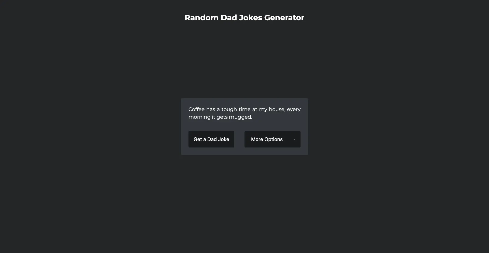

# Dad-jokes

This project is a web-based application that generates random dad jokes using an API. With just a click of a button, you can get a fresh new joke to share with your family and friends.

<hr>

💙 Join the channel to see more videos like this. [Code_With_Pankaj](https://www.youtube.com/c/CodeWithPankaj1?sub_confirmation=1)
<hr>

<div align=center>

## Must visit 👇 (Click on it)

[](https://www.youtube.com/c/CodeWithPankaj1?sub_confirmation=1)

</div>

<hr>

## Features

1. <b><u>Share jokes on social media:</u></b> Add buttons that allow users to share the joke they generated on social media platforms like Twitter or Facebook.

2. <b><u>Random joke of the day:</u></b> Show a new joke on the page each day.

## Technologies Used
The Dad Jokes Generator is built using HTML, CSS, and JavaScript. It also uses the icanhazdadjoke API to fetch and display the jokes.

## How to Use
To use the Dad Jokes Generator, simply click on the "Generate Joke" button on the page. The app will make a request to the icanhazdadjoke API and display the joke on the screen.

## Project Structure
The project contains the following files:

`index.html`: the main HTML file that contains the UI of the app.<br>
`style.css`: the CSS file that styles the UI.<br>
`script.js`: the JavaScript file that handles the logic of the app, including making the API request and updating the UI with the joke.<br>
`README.md`: this file, which contains information about the project.

## Authors

- [@pankajbaliyan](https://www.github.com/pankajbaliyan)

## Contributing

This project is open for contributions. If you would like to contribute to this project, you can fork the repository and submit a pull request.<br>
Contributions are always welcome!

See `index.html` for ways to get started.

Please adhere to this project's `code of conduct`.

## Demo

https://dad-jokes-cwp.vercel.app
<br><br>
https://pankajbaliyan.github.io/Dad-jokes/

## Feedback

If you have any feedback, please reach out to us at pankajbaliyan90@gmail.com

## 🔗 Links

[](https://codewithpankaj.vercel.app)

<a href="https://www.youtube.com/c/codewithpankaj1?sub_confirmation=1" target="blank"></a>
<a href="https://linkedin.com/in/pankaj-kumar-90" target="blank"></a><br><br>
<a href="https://leetcode.com/pankajkumar90/" target="blank"></a>
<a href="https://auth.geeksforgeeks.org/user/im_pankaj/practice/" target="blank"></a><br><br>
<a href="https://twitter.com/_pankaj_kumar__" target="blank"></a>
<a href="https://www.hackerrank.com/pankajbaliyan90" target="blank"></a>
<a href="https://discord.gg/qYz4cYc9zP" target="blank"></a>

## Lessons Learned

I learned many things while making this repository, i.e. how to make a webpage responsive to all devices screens and how to add hover effect on a webpage.
## Run Locally

Clone the project

```bash
  git clone https://github.com/PankajBaliyan/Dad-jokes.git
```

Go to the project directory

```bash
  cd Dad-jokes
```

Start code editor

```bash
  code .
```


## Screenshots




## Support

For support, email pankajbaliyan90@gmail.com or join our Slack channel.